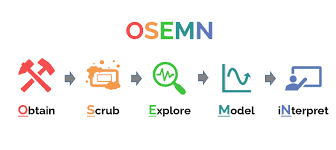

# **SoftUni Machine Learning (September - November 2024)**

1. Introduction to Machine Learning [notes](Machine_Learning_SoftUni_Sep_Nov_24/01.Introduction_to_Machine_Learning/notes.ipynb)
2. Linear and Logistic Regression [notes](Machine_Learning_SoftUni_Sep_Nov_24/02.Linear_and_Logistic_Regressions/notes.ipynb)
3. Model Training and Improvement [notes](Machine_Learning_SoftUni_Sep_Nov_24/03.Model_Training_and_Improvement/notes.ipynb)
4. Tree and Ensemble Methods [notes](#)
5. Support Vector Machines [notes](#)
6. Clustering [notes](#)
7. Dimensionality Reduction [notes](#)
8. Introduction to Neural Networks [notes](#)
9. Time series [notes](#)
10. Exam Preparation: End-to-end Project (Q&A session) [notes](#)
11. Course summary (Q&A session) [notes](#)

## Papers for review:
### Machine Learning:
#### Passed peer review:
1. Spatiotemporal Cluster Analysis of Gridded Temperature Data -- A Comparison Between K-means and MiSTIC, 2 Jul 2023 [link](https://arxiv.org/abs/2307.00480)
2. DTW k-means clustering for fault detection in photovoltaic modules, 13 Jun 2023 [link](https://arxiv.org/abs/2306.08003)
3. Fast Distributed k-Means with a Small Number of Rounds, 15 Mar 2023 [link](https://arxiv.org/abs/2201.13217)
4. Challenges and perspectives in recurrence analyses of event time series, 12 Sep 2024  [link](https://arxiv.org/abs/2409.08398)
4. Children Age Group Detection based on Human-Computer Interaction and Time Series Analysis, 7 Mar 2024  [link](https://arxiv.org/abs/2403.04574)
#### Without peer review:
1. Socially Fair k-Means Clustering, 17 Jun 2020 [link](https://paperswithcode.com/paper/fair-k-means-clustering)
2. Adaptively Robust and Sparse K-means Clustering, 9 Jul 2024 [link](https://paperswithcode.com/paper/adaptively-robust-and-sparse-k-means)
3. A Tutorial on Principal Component Analysis, 3 Apr 2014 [link](https://paperswithcode.com/paper/a-tutorial-on-principal-component-analysis)
4. AutoSoccerPose: Automated 3D posture Analysis of Soccer Shot Movements, 20 May 2024  [link](https://paperswithcode.com/paper/autosoccerpose-automated-3d-posture-analysis)

### Deep learning:
#### Passed peer review:
1. Dropout: A Simple Way to Prevent Neural Networks from Overfitting [link](chrome-extension://efaidnbmnnnibpcajpcglclefindmkaj/https://www.cs.toronto.edu/~rsalakhu/papers/srivastava14a.pdf)
2. Mish: A Self Regularized Non-Monotonic Activation Function [link](https://arxiv.org/abs/1908.08681)
3. A Fast Learning Algorithm for Deep Belief Nets [link](https://www.cs.toronto.edu/~hinton/absps/fastnc.pdf)
4. NiftyNet: a deep-learning platform for medical imaging [link](https://paperswithcode.com/paper/niftynet-a-deep-learning-platform-for-medical)
5. SCoralDet: Efficient real-time underwater soft coral detection with YOLO [link](https://paperswithcode.com/paper/scoraldet-efficient-real-time-underwater-soft   )
 
 

# **Introduction to Machine Learning and Artificial Intelligence (August - September 2024)**
 

**Lecturer:** Dr. Darshan Ingle

**Modules Covered:**
Matplotlib (matplotlib), WordCloud (wordcloud), HuggingFace Transformers (transformers), FastText (fasttext), Numpy (numpy), SMOTE (imblearn.over_sampling.SMOTE), GloVe (glove-python), Keras API (tensorflow.keras), NLTK (nltk), Seaborn (seaborn), Keras (tensorflow.keras), TQDM (tqdm), TensorFlow (tensorflow), Pandas (pandas), Scikit-learn (sklearn)

 
 

### Day 1: [notebook](ML_AI_notes_Aug_Sep_24/day_1.ipynb)
1. Numpy (Numerical Python)
2. Pandas (Python for Analytics and Data Science)
3. Matplotlib (Math Plotting Library)
### Day 2: [notebook](ML_AI_notes_Aug_Sep_24/day_2.ipynb)
1. Historical Context
2. Key Concepts in ML
3. Core Elements of Machine Learning
4. Supervised vs. Unsupervised Learning
5. Regression Models
6. Machine Learning Algorithms
7. Model Evaluation Metrics
8. Train/Test Split and Scaling
9. Advanced Techniques
10. Advanced Visualization and Exploration
11. Common Pitfalls in ML
### Day 3: [notebook](ML_AI_notes_Aug_Sep_24/day_3.ipynb)
1. Data Classification Models
2. Titanic Dataset
4. Unsupervised Learning
### Day 4: [notebook](ML_AI_notes_Aug_Sep_24/day_4.ipynb)
1. Artificial Neural Networks (ANN) and Deep Learning
2. Convolutional Neural Networks (CNN)
### Day 5: [notebook](ML_AI_notes_Aug_Sep_24/day_5.ipynb)
1. Recurrent Neural Networks (RNN)
2. Transformers and HuggingFace
3. Fine-Tuning Large Language Models (LLM)
4. Future Topics