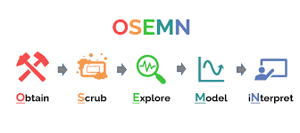

# **Introduction to Machine Learning and Artificial Intelligence (August - September 2024)**
 

**Lecturer:** Dr. Darshan Ingle

**Modules Covered:**
Matplotlib (matplotlib), WordCloud (wordcloud), HuggingFace Transformers (transformers), FastText (fasttext), Numpy (numpy), SMOTE (imblearn.over_sampling.SMOTE), GloVe (glove-python), Keras API (tensorflow.keras), NLTK (nltk), Seaborn (seaborn), Keras (tensorflow.keras), TQDM (tqdm), TensorFlow (tensorflow), Pandas (pandas), Scikit-learn (sklearn)

 
 

# Day 1: Introduction to Data Science, Numpy, Pandas, Matplotlib

## Numpy (Numerical Python):
**1. ndarray:** N-dimensional array used for handling large datasets in numerical computing.

**2. nparray:** A shorthand for numpy arrays; allows vectorized operations, making it efficient for large-scale calculations.

**3. Attributes:**
* **dtype:** Data type of elements in the array.
* **ndim:** Number of dimensions of the array.
* **shape:** The structure of the array (rows, columns).

**4. Creating arrays:**
* **np.array(data, dtype):** Creates a numpy array with specific data and data type.
* **np.zeros((2,3)):** Creates a 2x3 matrix filled with zeroes.
* **np.ones((2,3)):** Creates a 2x3 matrix filled with ones.
* **np.identity(3):** Generates a 3x3 identity matrix.
* **np.random.randint(3, 4):** Generates random integers within a range.
* **np.arange(12):** Creates an array with a sequence of numbers.
* **np.reshape(3, 4):** Reshapes an array into a 3x4 matrix.

**5. Linear Algebra Operations:**
* **np.linalg.solve:** Solves a linear matrix equation.

**6. Broadcasting:**
* Allows numpy to perform element-wise operations between arrays of different shapes.

**7. Common in Computer Imaging:**
* Numpy is frequently used in computer vision tasks for image data manipulation.

## Pandas (Python for Analytics and Data Science):
**1. Series and DataFrames:**
* **Series:** one-dimensional labeled array
* **DataFrames:** two-dimensional, allowing manipulation of tabular data.

**2. Basic Operations:**
* **Indexes:** Label-based indexing for accessing data.
* **Pandas broadcasting:** Applying operations over DataFrames.
* **pd.read():** Reads data from files into DataFrames.
* **head():** Displays the first few rows of a DataFrame.
* **shape:** Returns the dimensionality of a DataFrame.
* **Set options:** Adjusts display settings like the number of rows and columns.
* **Limit:** Pandas is best suited for datasets of up to 5-10 million rows; for larger datasets, PySpark or Apache architectures are recommended.

**3. Useful Methods:**
* **unique():** Returns unique values in a column.
* **normalize=True:** Normalizes data for better interpretability.
* **info():** Provides information about the DataFrame's structure.
* **df.values:** Returns the data as a NumPy array.
* **describe(include='all'):** Summarizes data statistics, including all columns.
* **select_dtypes(include/exclude):** Selects specific data types in the DataFrame.
* **pd.date_range(start, period, freq):** Creates a range of dates.
* **apply():** Applies a function along an axis of the DataFrame.
* **sum(axis=0/1):** Computes the sum along a specific axis.
* **loc vs. iloc:** Explicit vs. implicit indexing for data access.

**4. Merging and Concatenation:**
* **pd.merge(on='column'):** Merges DataFrames on a common column.
* **pd.concat:** Concatenates two or more DataFrames.
* **Sorting:**
    * **sort_values():** Sorts DataFrames by specified values.
    * **reset_index():** Resets the index of a DataFrame.
* **group_by():** Groups data by specific columns.

## Matplotlib (Math Plotting Library):
**1. Plotting:**
* **np.linspace(0, 10, 5):** Generates linearly spaced values for plotting.
* **plt.figure(figsize=(3,4)):** Creates a figure with specified dimensions.
* **plt.subplot(2,1,1):** Creates a subplot in a figure.

**2. Subplotting:**
* **fig, ax = plt.subplots(2):** Creates multiple subplots.
* **grid:** Adds a grid to the plot.
* **plt.axis('equal'):** Ensures equal scaling for both axes.

 
 

# Day 2: Classical Machine Learning - Regression models

## Historical Context:
* **Machine Learning (ML) has been evolving since 1949.**
* **"Data is the new oil" (2014):** Highlights the immense value of data in today's digital economy.
* **AI, ML, DL:** Artificial Intelligence, Machine Learning, and Deep Learning are interrelated fields, with DL being a subset of ML, which itself is a subset of AI.

## Key Concepts in ML:
**1. Traditional vs. ML Paradigm:**
* Traditional programming yields deterministic outputs (same input gives the same output), whereas ML models learn patterns and provide predictions.

**2. Training and Testing Split:**
* Machine Learning splits data into training (for learning) and testing (for evaluation).

**3. ML = Predictive Analytics:**
* The main objective of ML is to make predictions based on historical data.

## Core Elements of Machine Learning:
**1. Dependent Variable (Target) vs. Independent Variables (Features):**
* Dependent variable is what you are trying to predict (y), while independent variables (X) are the inputs.

**2. Data Splitting:**
* X_train, X_test, y_train, y_test split into training and testing sets.
* Correlation between independent variables is crucial for better model performance.

**3. Continuous vs. Discrete Targets:**
* In ML, target variables can be continuous (e.g., regression) or discrete (e.g., classification).

## Supervised vs. Unsupervised Learning:
**1. Supervised Learning:**
* Uses labeled data with both X and y to make predictions.

**2. Unsupervised Learning:**
* Only uses input data X, without labeled output y.

## Regression Models:
**1. Linear Regression:**
* Basic form: $y = mx + c$, where m is the slope and c is the y-intercept. The goal is to find the "line of best fit" that generalizes predictions.

**2. Polynomial Regression:**
* Extends linear regression by fitting a curve through the data points. $y = a_0 + a_1x + a_2x^2 + a_3x^3 + \cdots + a_nx^n$ 
Where $a_0, a_1x, a_2$ are the coefficients of the polynomial terms.

**3. Hyperplane:**
* In higher dimensions (3+), regression models fit a plane or hyperplane instead of a line.

**4. Risk in Extrapolation:**
* Extrapolating beyond the range of data is risky and prone to errors.

## Machine Learning Algorithms:
**1. Regression Algorithms:**
* **Linear Regression:** Simple and widely used but limited for non-linear relationships.
* **Decision Trees:** More complex but offer higher accuracy.
* **Random Forest:** A collection of decision trees for better generalization (n_estimators=100 by default).
* **XGBoost:** Optimized version of boosting algorithms for high performance.

**2. Feature Selection:**
* **Recursive Feature Elimination (RFE):** Iteratively removes less important features.
* **RFECV:** Cross-validated version of RFE to improve model reliability.

## Model Evaluation Metrics:
**1. Metrics:**
* **Mean Absolute Error (MAE):** Average magnitude of errors. 
$$\text{MAE} = \frac{1}{n} \sum_{i=1}^{n} | y_i - \hat{y}_i |$$
* **Mean Squared Error (MSE):** Penalizes larger errors more than MAE.
$$\text{MSE} = \frac{1}{n} \sum_{i=1}^{n} (y_i - \hat{y}_i)^2$$
* **Root Mean Squared Error (RMSE):** Square root of MSE; commonly used in regression models.
$$\text{RMSE} = \sqrt{ \frac{1}{n} \sum_{i=1}^{n} (y_i - \hat{y}_i)^2 }$$
* **R² Score:** Measures the proportion of variance explained by the model, where a value closer to 1 is better (0.8 is industry standard).
$$R^2 = 1 - \frac{\sum_{i=1}^{n} (y_i - \hat{y}_i)^2}{\sum_{i=1}^{n} (y_i - \bar{y})^2}$$
* **Adjusted R²:** Adjusts R² for the number of predictors, accounting for their significance.
$$\text{Adjusted } R^2 = 1 - \frac{(1 - R^2)(n - 1)}{n - p - 1}$$

Where:
* $y_i = $ Actual value
* $\hat{y}_i = $ Predicted value
* $\bar{y} = $ Mean of actual values
* $n = $ Number of data points
* $p = $ Number of predictors in the model

2. Industry standard: 
* Testing accuracy  $>= 80\%$ (Prevent Underfitting)
* $(A_{training} - A_{testing}) < 5\%$ (Prevent Overfitting)

## Train/Test Split and Scaling:
**1 Train/Test Split:**
* Commonly 80% training and 20% testing.
* **Shuffle=True** by default to avoid bias.

**2. Scaling and Normalization:**
* **MinMax Scaler:** Rescales features to a range [0, 1].
$$X_{\text{scaled}} = \frac{X - X_{\text{min}}}{X_{\text{max}} - X_{\text{min}}}$$
* **Standard Scaler (Z-score):** Centers around 0 with a standard deviation of 1. This is often preferred over MinMax scaling.
$$Z = \frac{X - \mu}{\sigma}$$
Where 𝜇 is the mean and σ is the standard deviation of the dataset.

## Advanced Techniques:
**1. Hyperparameter Tuning:**
* Adjusting model parameters to optimize performance using techniques like GridSearchCV.

**2. Support Vector Regressor (SVR):**
* Used for both regression and classification with high accuracy, especially in complex datasets.

## Advanced Visualization and Exploration:
**1. Seaborn:**
* **sns.pairplot():** Visualizes relationships between pairs of features.
* **sns.heatmap():** Displays correlation matrices with color-coding.

**2. Multicollinearity:**
* Detects high correlation between independent variables, which can affect model performance.
* Use **Pearson's correlation** coefficient for analysis.

## Common Pitfalls in ML:
**1. Overfitting:**
* When a model performs too well on training data but poorly on testing data (train-test score difference > 0.5).

**2. Underfitting:**
* When the model fails to capture underlying patterns (train score < 0.8).

 
 

# Day 3: Classical Machine Learning: Data Classification Models. Unsupervised Learning (K-means Clustering)

## Key Concepts:
**1. Hyperparameter Tuning:**
* **GridSearchCV:** Searches exhaustively over a specified parameter grid to find the best combination.
* **RandomizedSearchCV:** Samples a fixed number of parameter combinations from a specified distribution, making it faster than GridSearchCV.

**2. Classification Algorithms:**
* Focus on predicting categorical outcomes (e.g., whether a passenger survived on the Titanic).

**3. Metrics:**
* Evaluating model performance based on various metrics.

## Titanic Dataset:
**1. Objective:**
* Predict passenger survival based on features from the dataset.

**2. Data Preparation:**
* **Handling Missing Values:**
    * fillna() method in Pandas: Fills missing values in the dataset.
    * Use mode() for categorical data (most frequent value).
    * For numerical data:
        * If data is normally distributed, use the mean.
        * For skewed data, use the median.
* **Skewness:**
    * Data with skewness between -0.5 and 0.5 is almost symmetrical, so filling missing values with the mean is reasonable.
    * For positively or negatively skewed data, use the median.

**3. Feature Engineering:**
* **Family Size:** Creating new features from existing data.
* **Get Dummies:** Convert categorical variables into dummy/indicator variables using pd.get_dummies().
    * **Drop First:** Avoids multicollinearity by dropping the first dummy variable.

**4. Normalization:**
* **Standard Scaler:** Normalizes data by scaling features to have a mean of 0 and a standard deviation of 1.

**5. Modeling:**
* **Logistic Regression:**
    * **Accuracy Score:** Proportion of correctly classified instances.
    * **Confusion Matrix:** A table showing the performance of a classification model, detailing false positives, false negatives, true positives, and true negatives.
        * **False Positive (FP):** Incorrectly predicted positive.
        * **False Negative (FN):** Incorrectly predicted negative.
        * **True Positive (TP):** Correctly predicted positive.
        * **True Negative (TN):** Correctly predicted negative.
    * **Accuracy:** (TP + TN) / N where N is the total number of samples, useful when data is balanced.
    * **Sensitivity (Recall):** TP / (TP + FP), measures the proportion of actual positives correctly identified.
    * **Specificity:** TN / (TN + FP), measures the proportion of actual negatives correctly identified.
    * **F1 Score:** Harmonic mean of precision and recall, useful for imbalanced datasets.

**6. Decision Tree Classifier:**
* A model that splits data into branches to make predictions based on feature values.

**7. CatBoost Classifier:**
* A gradient boosting algorithm that handles categorical features well.

## Unsupervised Learning:
**1. Clustering:**
* **Objective:** Grouping unlabeled data into clusters based on similarity.
* **Centroid:** The average of all points in a cluster.

**2. K-means Clustering:**
* **Euclidean Distance:** Measures the distance between points and centroids.
* **Iteration:** Algorithm iterates until cluster assignments no longer change.
* **Shopping Mall Example:** Using clustering to segment customers based on their shopping behaviors.

**3. Clustering Techniques:**
* **Hopkins Test:** Determines if clustering is feasible by running 1000 iterations and checking the number of values greater than 0.7.
* **Elbow Method:** Helps determine the optimal number of clusters by plotting the inertia (within-cluster variance) against the number of clusters.
* **Silhouette Score:** Evaluates the cohesion and separation of clusters.
* **Hierarchical Clustering:** Builds a hierarchy of clusters using either agglomerative (bottom-up) or divisive (top-down) methods.
    * **Not Ideal for Categorical Data:** K-means may struggle with categorical features.

**4. TQDM:**
* Provides a progress bar for iterations, useful for monitoring long-running processes.

 
 

# Day 4: Artificial Neural Networks (ANN) and Deep Learning. Convolutional Neural Networks (CNN)
## Key Concepts:
**1. Artificial Neural Networks:**
* **Mimic Human Brain:** ANN models aim to simulate how the human brain processes information.
* **Basic Flow:** Input → Processing → Output

**2. Training Process:**
* **Epoch:** One forward pass (propagation) + one backward pass (propagation) through the network. An epoch refers to a complete iteration over the entire training dataset.

**3. Frameworks and Libraries:**
* **TensorFlow:** A popular open-source library for building and training neural networks.
* **Keras API:** A high-level API for building and training neural networks that runs on top of TensorFlow (included in TF 2.0).

**4. Artificial Neuron (Perceptron):**
* Developed in 1949, it is a basic unit of neural networks, inspired by biological neurons.

**5. Example:**
* Predicting whether to attend a Punjabi food festival based on weather, spouse’s preference, and availability of train/metro.

**6. Mathematics of Neurons:**
* **Thresholding:** An artificial neuron fires if the weighted sum of inputs exceeds a certain threshold 
$$ \sum_{i} (X_i \cdot w_i) \geq \text{threshold} $$
$$ \sum_{i} (X_i \cdot w_i) - \text{threshold} \geq 0 $$
* **Bias:** 
$$b = - \text{threshold}$$
* **Activation Decision:**
$$\begin{align*}
\text{If }(w \cdot x) + b &\leq 0, \quad \text{the output is \textbf{false.}} \\
\text{If }(w \cdot x) + b &> 0, \quad \text{the output is \textbf{true.}}
\end{align*}$$

**7. Activation Functions:**
* **Early Activation:** Step activation function (discrete, obsolete).
* **Current Activation Functions:**
    * **Binary Classification:** sigmoid
    * **Multiclass Classification:** softmax
    * **Regression:** linear
    * **Hidden Layers:**
        * **ReLU** (Rectified Linear Unit)
        * **Leaky ReLU**
        * **ELU** (Exponential Linear Unit): Good for reducing bias.
        * **GELU** (Gaussian Error Linear Unit)
        * **SELU** (Scaled Exponential Linear Unit)
        * **SiLU** (Sigmoid Linear Unit)
    * **Tanh:** Hyperbolic tangent function, useful for NLP tasks with values in the range [-1, 1].
    * **Mish:** Effective for computer vision tasks.
* [TensorFlow Activation Functions](https://www.tensorflow.org/api_docs/python/tf/keras/activations)
* [Keras Activation Functions](https://keras.io/api/layers/activations/#tanh-function)

**8. Model Building:**
* **Single Perceptron Neural Network Example:** Basic ANN with one neuron.
* **Activation Function:** Sigmoid for binary classification. SoftMax for multiclass.
* **Dense Layers:** Fully connected layers where each neuron is connected to every neuron in the previous layer.

**9. Optimization:**
* **Optimizers:**
    * **Adam:** Adaptive Moment Estimation.
    * **SGD (Stochastic Gradient Descent):** A method for optimizing the loss function.
* **Loss Functions:**
    * **Binary Crossentropy:** Used for binary classification.
    * **Sparse Categorical Crossentropy:** Used for multi-class classification where labels are integers.

**10. Training Process:**
    * **Forward Pass:** Calculating output from the input data.
    * **Backpropagation:** Adjusting weights based on the error from the forward pass.
    * **1 Epoch:** Includes one forward pass and one backward pass.

**11. Evaluation Metrics:**
* **Accuracy:** Measure of how often the model's predictions are correct.
* **Graphs:**
    * **Loss/Validation Loss Graph:** Shows how the loss changes over epochs.
    * **Accuracy/Validation Accuracy Graph:** Shows how the accuracy changes over epochs.
* **r.history:** Object storing training metrics for plotting.

**12. Output Handling:**
* **Probability Output:** Neural networks often output probabilities (e.g., [0, 1] for binary classification).
* **Rounding and Flattening:** Convert probabilities to class labels if necessary.

**13. Saving and Defining Models:**
* Saving: Save the model using a '.keras' extension.
* Define SGD: Custom implementation if needed.
* Pass model for Deployment.

**14. MNIST Dataset:**
* A classic dataset for digit recognition tasks.

**15. Batch Size:**
* Default is 32. 
* Refers to the number of samples processed before the model's internal parameters are updated.

**16. Cluster Analysis:**
* **Number of Neurons:** A common heuristic (approach to problem solving that employs a pragmatic method that is not fully optimized) is $2^n$ for hidden layers where n is the number of input features (peceptron count).

**17. Softmax Activation:**
* Used for multiclass classification to convert logits to probabilities and handle overfitting.

**18. Dropout:** 
* A Simple Way to Prevent Neural Networks from Overfitting
* [Paper](https://www.cs.toronto.edu/~rsalakhu/papers/srivastava14a.pdf)

**19. Transfer Learning:**
* **Concept of Tranfer Learning:** a pretrained model reused or adapted to a different, but related task.
* Image handling using Transfer Learning with pretrained models
* **Example:** Image recognition using VGG16
* **Preprocessing for VGG16:**
    * Typical preprocessing steps to adapt data for the VGG16 model involves resizing and normalization.
* [Pretrained Model Suggestions ChatGPT](https://chatgpt.com/share/1f3d3db9-5181-40c1-a29a-c981d77cf8ad)

 
 

# Day 5: Recurrent Neural Networks (RNN) and Large Language Models (LLM)
## Recurrent Neural Networks (RNN):
**1. Purpose:** 
* Designed to handle sequential data, such as time series or text.
* **Activation Function:** Often use the tanh activation function to introduce non-linearity.

**2. Sequence to Sequence Modeling:**
* A type of RNN model used for tasks like translation or summarization where input and output are sequences.

**3. Word Embeddings:**
* Represent words as vectors in a continuous vector space, capturing semantic meanings.

**4. Text Prerocessing:**
* **Lowercasing:** Converts all characters to lowercase.
* **Tokenization:** Splits text into words or tokens.
* **Punctuation and Stop Words Removal:** Eliminates unnecessary punctuation and common words that might not contribute to meaning.
* **Stemming and Lemmatization:** Reduces words to their base or root forms.
* **Handling Contractions:** Expands contractions (e.g., “don’t” to “do not”).
* **Emoji handling:**
    * **Mapping Emojis:** Map emojis to textual representations to include them in text analysis.
    * [Solutions ChatGPT](https://chatgpt.com/share/aa12a519-9b42-429c-b530-4771d62c2178)

**5. NLTK Library:**
* **Stem:** Provides stemming functionalities.

**6. Sentiment Analysis Preprocessing:**
* Involves cleaning and preparing text data for sentiment classification.

**7. Count Vectorizer:**
* Bag of Words Model: Represents text as the frequency of words. Not very powerful but simple.

**8. TF-IDF (Term Frequency-Inverse Document Frequency):**
* A more advanced technique that reflects how important a word is in a document relative to its frequency across all documents.

**9. Sentiment Classification:**
**Examples:** Analyzing movie reviews or restaurant feedback to classify sentiment.

**10. The Vanishing Gradient Problem:**
* A problem where gradients become very small during backpropagation, causing slow learning.

**11. Long Short-Term Memory (LSTM):**
* A type of RNN that can remember long-term dependencies by using memory cells to store information.

**12. Attention Mechanism:**
* Allows models to focus on different parts of the input sequence when making predictions.

**13. Transformers:**
* Models that handle entire sequences at once, addressing limitations of RNNs.

14. ANM retention comparison:
* **RNN:** Can remember up to 8 words.
* **LSTM**: Can remember 50-100 words.
* **Attention Mechanism:** Handles 1000 words.
* **Transformers:** Efficiently process entire sequences.

**15. Spam/Ham Classification example:**
* Classification task to differentiate between spam and non-spam messages.

**16. Handling Class Imbalance:**
*   Techniques such as **SMOTE** (Synthetic Minority Over-sampling Technique), **MSMOTE** (Modified SMOTE), **KNN** (K-Nearest Neighbors), and **boosting**.

**17. Keras Pad Sequences:**
* Adds padding to sequences to ensure uniform length across all input sequences.

**18. Early Stopping:**
* Stops training when the model's performance on a validation set stops improving, based on hyperparameters like **min_delta** and **patience**.

**19. Embedding:**
* Represents categorical variables (like words) as dense vectors.

**20. Sparse vs. Dense Matrices:**
* **Sparse Matrix:** Contains mostly zeros, used to store large-scale data efficiently.
* **Dense Matrix:** Contains mostly non-zero elements.

**21. Word Embedding Models:**
* **GloVe (Global Vectors for Word Representation):** Pretrained embeddings capturing word similarities.
* **FastText:** Extends word embeddings to include subword information.
* **GoogleNet and AlexNet:** Convolutional neural networks for image classification (not directly related to text, but influential in neural network development).

## Transformers and HuggingFace:

**1. HuggingFace:** 
* Provides pre-trained transformer models and tools.
* [HuggingFace link](https://huggingface.co)
* **Example:** Summarizing text using HuggingFace's models. Image generation. Translation.

**2. DistilBART:** A distilled version of the BART model for text summarization.

**3.Retrieval-Augmented Generation (RAG):**
* Combines retrieval-based and generative approaches for more effective text generation.

## Fine-Tuning Large Language Models (LLM):

**1. OpenAI Playground:**
* An interactive tool for experimenting with OpenAI's language models.
* Adjusting pre-trained models to better fit specific tasks or datasets.
* Retrieval-Augmented Generation

## Future Topics:
**1. Intro to GANs (Generative Adversarial Networks):** 
* Models for generating new data samples.

**2. VAEs (Variational Autoencoders):** 
* Generative models that learn latent representations.

**3. OpenAI API:** 
* API for interacting with OpenAI models.

**4. Prompt Engineering:** 
* Designing effective prompts for LLMs.

**5. LangChain:** 
* Framework for building applications with language models.

**6. Other Models:** 
* Exploring models like LLaMA (Large Language Model Meta AI).

**7. RAG:** 
* Retrieval-Augmented Generation